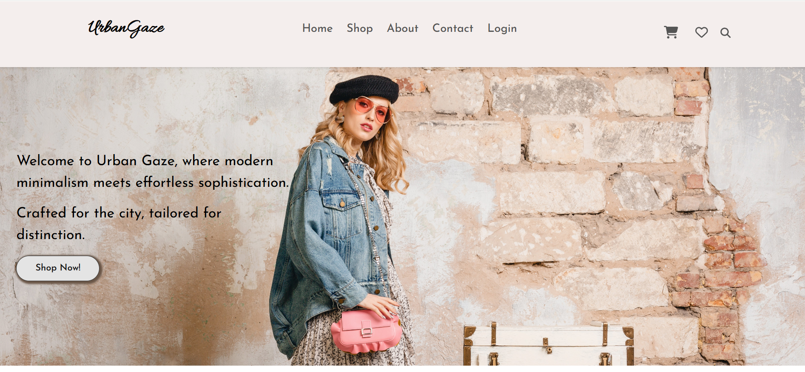
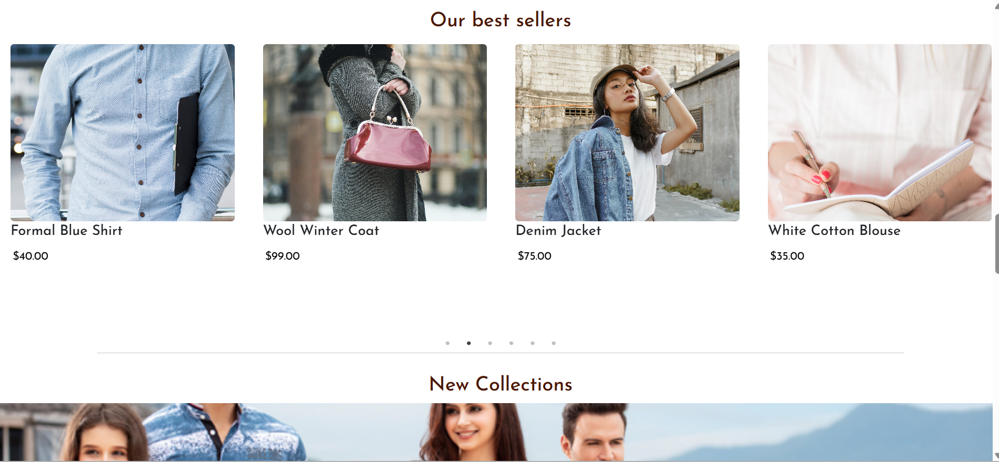
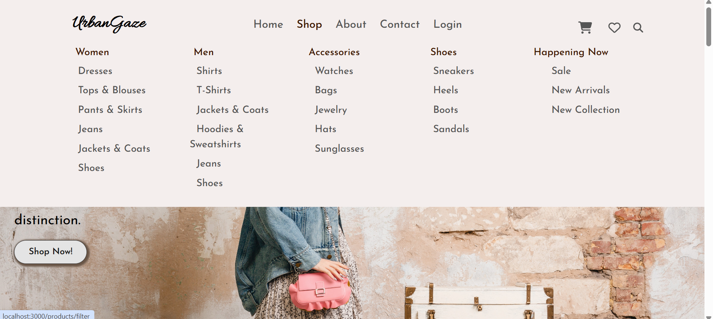
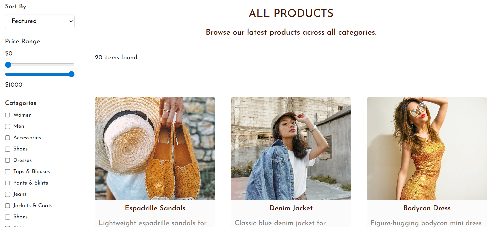
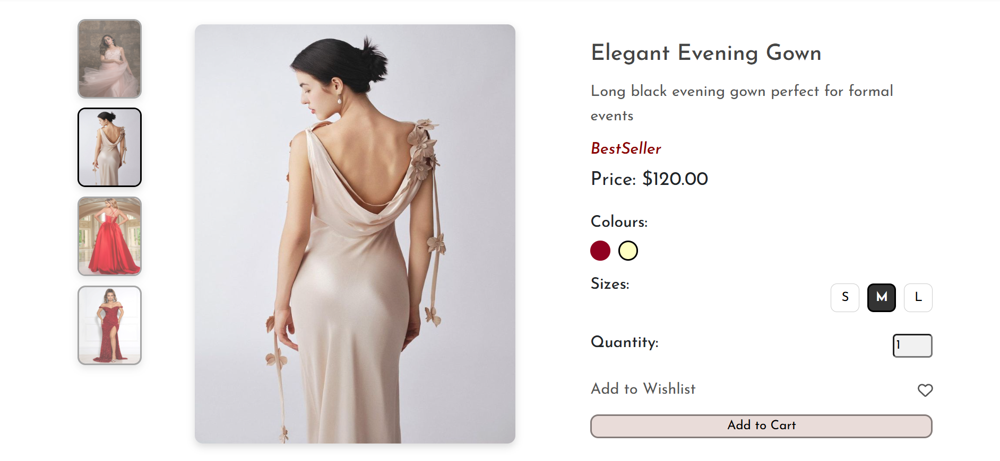
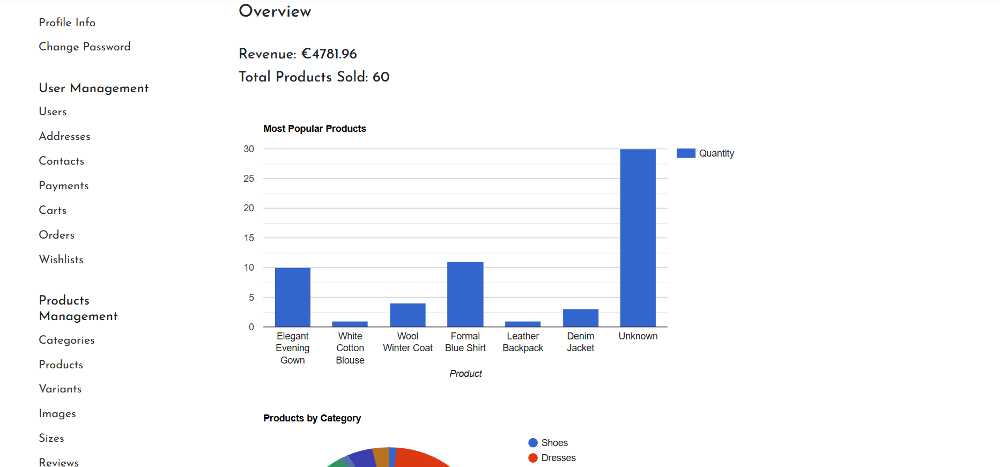

# FashionWebsite

FashionWebsite is a full-stack fashion e-commerce platform built with a React frontend and a Laravel backend.  
The application allows customers to browse products, filter items, manage their cart and wishlist, complete payments through Stripe, and use a secure account system. It also includes an admin dashboard for managing products, orders, users, and other store data.

## Features

- Responsive fashion storefront for desktop and mobile
- Product browsing with categories, search, filtering, and sorting
- Product detail pages with images, sizes, variants, stock, and reviews
- User registration, login, profile management, and password reset
- Wishlist and shopping cart functionality
- Stripe payment integration for checkout
- Admin dashboard for managing products, users, orders, payments, categories, collections, discounts, and reviews
- Contact form for customer messages

## Tech Stack

**Frontend:** React.js, React Router, Axios, Bootstrap, React Bootstrap  
**Backend:** PHP, Laravel, JWT Authentication, Eloquent ORM  
**Database:** MySQL  
**Payments:** Stripe  
**Tools:** Git, Composer, npm

## Project Structure

```text
FashionWebsite/
├── backend/       # Laravel REST API
├── frontend/      # React client application
└── README.md
```

The backend contains the API routes, controllers, models, migrations, authentication logic, and payment handling.  
The frontend contains the user interface, pages, reusable components, routing, and API communication.

## Installation

### 1. Clone the repository

```bash
git clone <repository-url>
cd FashionWebsite
```

### 2. Set up the backend

```bash
cd backend
composer install
cp .env.example .env
php artisan key:generate
php artisan jwt:secret
php artisan migrate
php artisan serve
```

Update the `.env` file with your database, mail, and Stripe credentials.

### 3. Set up the frontend

```bash
cd frontend
npm install
npm start
```

The frontend usually runs on:

```text
http://localhost:3000
```

The backend API usually runs on:

```text
http://localhost:8000/api
```

## Usage

Customers can browse products, search and filter items, create an account, add products to the cart or wishlist, leave reviews, and complete checkout using Stripe.

Admins can access the dashboard to manage store data such as products, orders, users, categories, discounts, payments, and customer messages.


## Screenshots

### Home Page



### Navbar with categories


### Shop Page


### Product Details


### Dashboard



## What I Learned

Through this project, I improved my skills in full-stack development, REST API integration, user authentication, database relationships, payment processing, and responsive UI design. I also gained experience working with real e-commerce workflows such as cart management, order creation, stock handling, and admin-side data management.

## Future Improvements

- Add better product recommendation features
- Improve dashboard analytics
- Add order status tracking
- Add email notifications for orders and password reset
- Add automated tests for important backend and frontend features
- Deploy the application online

## Contributor

Diella Veliu
